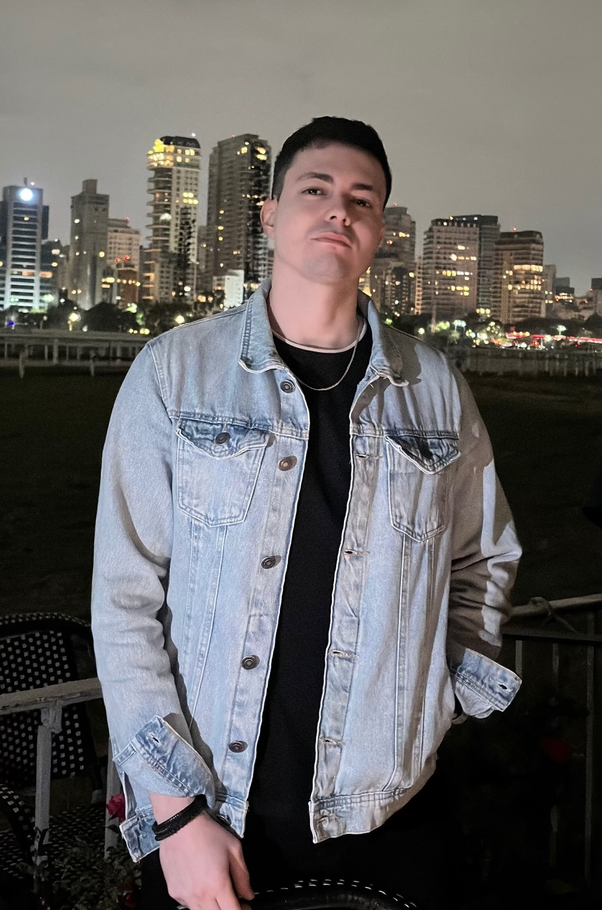
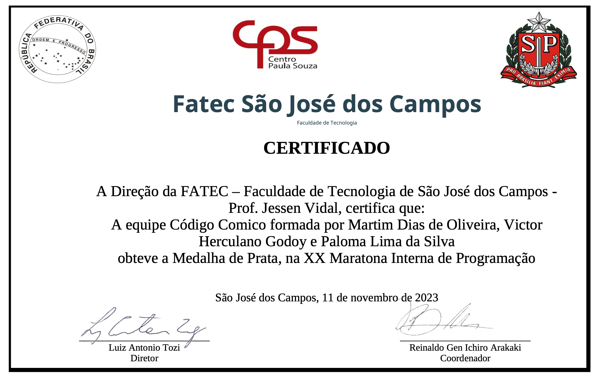
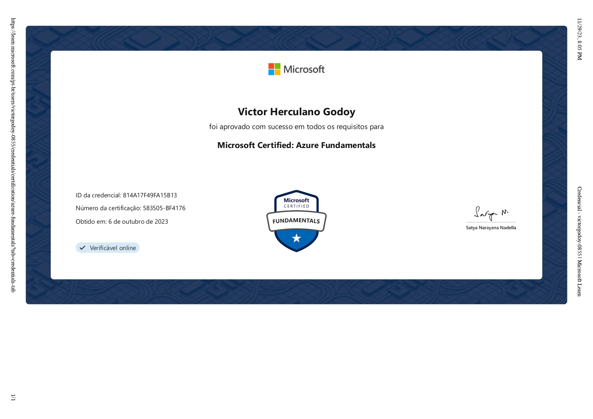

# Portifólio Acadêmico

### Introdução   
Olá meu nome é Victor Godoy, atualmente estou cursando o 5º semestre do curso de Análise e Desenvolvimento de Sistemas na Fatec São José dos Campos - Prof. Jessen Vidal.

### Motivação
Tudo começou meio por acaso, vendo meu primo trabalhar com programação, meu interesse veio mesmo na prática: entrei na FATEC e, logo no primeiro semestre, conquistei o 2º lugar na maratona de programação.

Hoje, foco minha evolução no ecossistema Full Stack. Mais do que escrever código, gosto de entender como a estrutura se sustenta, aplicando boas práticas de arquitetura para construir sistemas complexos bem organizados. Além disso, busco dominar o ciclo completo da aplicação, explorando cada vez mais a infraestrutura para garantir que sistemas complexos operem em ambientes escaláveis e de alta disponibilidade.

### Conquistas e Certificações

<table>
  <tr>
    <td align="center">
       
      <b>2º Lugar Maratona de Programação</b>
    </td>
    <td align="center">
       
      <b>Microsoft Certified: Azure Fundamentals</b>
    </td>
  </tr>
</table>

### Histórico Profissional
Atualmente sou Desenvolvedor Full Stack em uma startup focada em soluções tecnológicas para o ecossistema de beleza, cuja missão é atuar no ciclo completo de desenvolvimento de novas funcionalidades e evolução do produto. Minhas atribuições concentram-se no desenvolvimento de sistemas complexos, lidando com desafios reais de arquitetura de software, otimização, modelagem de bancos de dados e segurança da informação, sempre focando em transformar regras de negócio em código eficiente e escalável. No dia a dia, utilizo Laravel para a construção de APIs REST sólidas e Angular para criar interfaces dinâmicas, priorizando a melhor experiência de usabilidade para o usuário final.

---

### Contato

### Principais Conhecimentos

**Linguagens**  
`TypeScript` `PHP` `Java`

**Back-end**  
`Laravel` `NestJS` `Spring Boot`

**Front-end**  
`Angular` `React` `TailwindCSS`

**Banco de Dados**  
`PostgreSQL` `MySQL`

**DevOps & Ferramentas**  
`Docker` `Git`

### Meus Projetos

---

**2023-2 — Plataforma Web sobre Scrum**
Empresa parceira: FATEC São José dos Campos - SP
[Repositório](projects/api-1-semestre.md)

---

**2024-1 — Aplicação Desktop com Consulta em Linguagem Natural**
Empresa parceira: FATEC São José dos Campos - SP
[Repositório](projects/api-2-semestre.md)

---

**2025-1 — Plataforma Web com Dashboard de Comércio Exterior Brasileiro**
Empresa parceira: FATEC São José dos Campos - SP
[Repositório](projects/api-3-semestre.md)

---

**2025-2 — Plataforma Web com Agente de IA para Registro Aduaneiro**
Empresa parceira: Empresa TecSys
[Repositório](projects/api-4-semestre.md)

